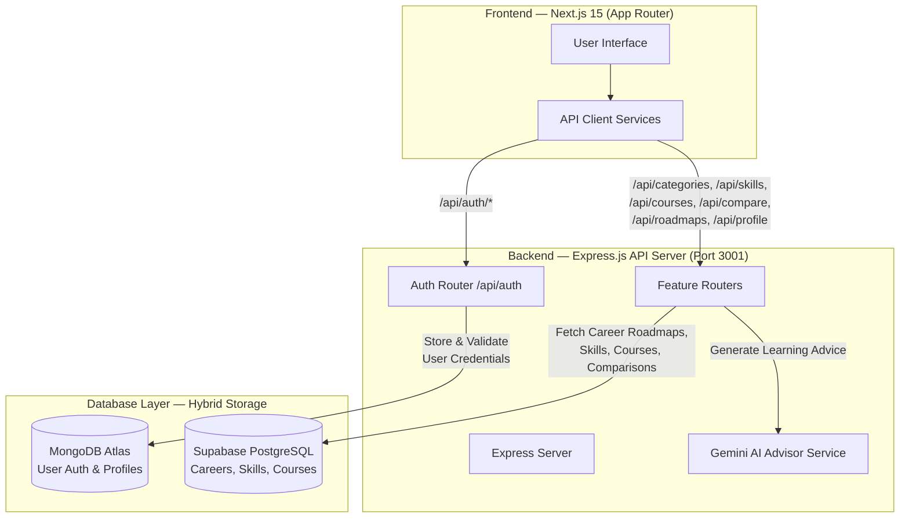

# 🧠 Mastermind — Career Pathway Guidance System

> A modern, full-stack web application that guides students through career pathways using **skill mapping**, **AI-powered advising**, **course recommendations**, and **interactive learning roadmaps**.

---

## 📐 System Architecture

Our platform uses a **hybrid database architecture**, separating user authentication from application data:



---

## 📦 Project Structure

This is a **monorepo** with separate `frontend` and `backend` applications under `apps/`:

```
Team8/
├── .gitignore                          # Root monorepo ignore rules
├── .gitattributes                      # Line ending rules (LF)
├── README.md                           # This file
│
└── apps/
    ├── backend/                        # Node.js + Express API Server
    │   ├── server.js                   # Entry point (ESM)
    │   ├── .env                        # Backend secrets (NOT committed)
    │   ├── .gitignore
    │   ├── package.json
    │   ├── database.sql                # PostgreSQL schema
    │   ├── config/
    │   │   └── db.js                   # MongoDB connection
    │   ├── middleware/                 # Auth & validation middleware
    │   ├── models/                     # Mongoose models (MongoDB)
    │   ├── routes/                     # API route handlers
    │   │   ├── auth.js                 # POST /api/auth/signup|login|reset
    │   │   ├── categories.js           # GET|POST /api/categories
    │   │   ├── skills.js               # GET|POST /api/skills
    │   │   ├── courses.js              # GET|POST /api/courses
    │   │   ├── compare.js              # GET|POST /api/compare
    │   │   ├── roadmaps.js             # GET /api/roadmaps
    │   │   ├── profile.js              # GET|PUT /api/profile
    │   │   └── ai.js                   # POST /api/ai/chat
    │   └── services/                   # External service integrations
    │       ├── supabaseService.js      # Supabase PostgreSQL queries
    │       ├── onetGeminiService.js    # Gemini AI career advisor
    │       ├── roadmapSyncService.js   # Roadmap.sh data sync
    │       ├── jobService.js           # Adzuna Jobs API
    │       └── industryService.js      # NewsAPI industry data
    │
    └── frontend/                       # Next.js 15 + TypeScript
        ├── .env.local                  # Frontend env (NOT committed)
        ├── .gitignore
        ├── package.json
        ├── next.config.ts
        ├── tailwind.config.js
        ├── tsconfig.json
        └── src/
            ├── app/                    # App Router pages
            │   ├── layout.tsx          # Root layout
            │   ├── page.tsx            # Landing page
            │   ├── login/              # Login page
            │   ├── signup/             # Sign-up page
            │   ├── forget-password/    # Forgot password
            │   ├── reset-password/     # Reset password
            │   └── dashboard/          # Protected dashboard
            │       ├── layout.tsx      # Dashboard layout
            │       ├── page.tsx        # Dashboard home
            │       ├── categories/     # Career Categories
            │       ├── skills/         # Skill Mapping
            │       ├── courses/        # Course Suggestions
            │       ├── compare/        # Career Comparison
            │       ├── roadmaps/       # Learning Roadmaps
            │       ├── profile/        # User Profile
            │       └── settings/       # Settings
            ├── components/             # Shared UI components
            │   ├── DashboardNavbar.tsx
            │   ├── ActionCard.tsx
            │   └── ui/
            ├── features/               # Feature-specific logic
            ├── lib/                    # Utilities & API client
            └── styles/                 # Global CSS
```

---

## 🛠 Tech Stack

### Backend (`apps/backend`)
| Layer | Technology |
|-------|------------|
| Runtime | Node.js (ESM) |
| Framework | Express.js |
| Auth DB | MongoDB Atlas (via Mongoose) |
| App DB | Supabase (PostgreSQL) |
| AI | Google Gemini API (`@google/generative-ai`) |
| Auth | JWT (`jsonwebtoken`) |
| Jobs API | Adzuna |
| News API | NewsAPI |
| Dev Server | Nodemon |

### Frontend (`apps/frontend`)
| Layer | Technology |
|-------|------------|
| Framework | Next.js 15 (App Router) |
| Language | TypeScript |
| UI Library | React 19 |
| Styling | Tailwind CSS v3 + Global CSS |
| Notifications | Sonner (toast library) |

---

## 🚀 Quick Start

### Prerequisites
- **Node.js** 18+ ([download](https://nodejs.org))
- **npm** 9+
- MongoDB Atlas account
- Supabase project
- Google AI Studio API key (Gemini)

---

### 1. Clone & Install

```bash
git clone https://github.com/DHARANIVIP/Team-8.git
cd Team-8
```

Install backend dependencies:
```bash
cd apps/backend
npm install
```

Install frontend dependencies:
```bash
cd ../frontend
npm install
```

---

### 2. Configure Environment Variables

#### Backend — `apps/backend/.env`
```env
# ── MongoDB (User Auth) ──────────────────────────────────────────────
MONGODB_URI=mongodb+srv://<user>:<password>@cluster.mongodb.net/<dbname>?retryWrites=true

# ── Supabase (App Data) ──────────────────────────────────────────────
NEXT_PUBLIC_SUPABASE_URL=https://your-project-id.supabase.co
SUPABASE_SERVICE_ROLE_KEY=your_service_role_key

# ── Google Gemini AI ─────────────────────────────────────────────────
GEMINI_API_KEY=AIzaSy...

# ── JWT Session ──────────────────────────────────────────────────────
JWT_SECRET=your_long_random_jwt_secret

# ── Server ───────────────────────────────────────────────────────────
PORT=3001

# ── Job & Industry APIs (optional) ──────────────────────────────────
NEWS_API_KEY=your_newsapi_key
ADZUNA_APP_ID=your_adzuna_app_id
ADZUNA_API_KEY=your_adzuna_api_key
```

#### Frontend — `apps/frontend/.env.local`
```env
NEXT_PUBLIC_API_URL=http://localhost:3001
```

---

### 3. Run Locally

**Terminal 1 — Backend:**
```bash
cd apps/backend
npm run dev
# ✅ Server running on http://localhost:3001
# 📊 Health check: http://localhost:3001/health
```

**Terminal 2 — Frontend:**
```bash
cd apps/frontend
npm run dev
# ✅ App running on http://localhost:3000
```

---

## 📡 API Reference

All routes are prefixed with `/api`:

| Method | Endpoint | Description | Auth Required |
|--------|----------|-------------|:---:|
| `POST` | `/api/auth/signup` | Register a new user | ❌ |
| `POST` | `/api/auth/login` | Login & receive JWT | ❌ |
| `POST` | `/api/auth/forgot-password` | Send password reset email | ❌ |
| `POST` | `/api/auth/reset-password` | Reset password with token | ❌ |
| `GET` | `/api/categories` | List all career categories | ✅ |
| `GET` | `/api/categories/:id` | Get category by ID | ✅ |
| `GET` | `/api/skills` | List all skills | ✅ |
| `POST` | `/api/skills/matrix` | Calculate skill matrix score | ✅ |
| `GET` | `/api/courses` | List all courses | ✅ |
| `GET` | `/api/courses/by-skill/:skillId` | Courses filtered by skill | ✅ |
| `POST` | `/api/courses/recommendations` | AI-powered course recommendations | ✅ |
| `GET` | `/api/compare` | List saved comparisons | ✅ |
| `POST` | `/api/compare/metrics` | Compute comparison metrics | ✅ |
| `POST` | `/api/ai/chat` | AI career advising chat | ✅ |
| `GET` | `/api/roadmaps` | Fetch learning roadmaps | ✅ |
| `GET` | `/api/profile` | Get user profile | ✅ |
| `PUT` | `/api/profile` | Update user profile | ✅ |
| `GET` | `/health` | Server health check | ❌ |

---

## 👥 Team Assignments

| # | Teammate | Feature | Backend Route | Frontend Page |
|---|----------|---------|---------------|---------------|
| 1 | TM-1 | AI Chat & Advising | `/api/ai/chat` | Dashboard (integrated) |
| 2 | TM-2 | Career Categories | `/api/categories` | `/dashboard/categories` |
| 3 | TM-3 | Skill Mapping | `/api/skills` | `/dashboard/skills` |
| 4 | TM-4 | Course Suggestions | `/api/courses` | `/dashboard/courses` |
| 5 | TM-5 | Career Comparison | `/api/compare` | `/dashboard/compare` |

---

## 🗄 Database Schema

### MongoDB (User Auth — `mongoose` models)
- **User** — email, hashed password, reset token, timestamps

### Supabase / PostgreSQL (App Data — `database.sql`)
- **careers** — career pathways and metadata
- **skills** — technical and soft skills
- **courses** — learning resources linked to skills
- **comparisons** — user-saved career comparisons
- **user_profiles** — student preferences and progress tracking

---

## 📝 Available Scripts

### Backend (`apps/backend`)
```bash
npm run dev       # Start dev server with Nodemon (hot reload)
npm start         # Start production server
```

### Frontend (`apps/frontend`)
```bash
npm run dev       # Start Next.js dev server (http://localhost:3000)
npm run build     # Build for production
npm start         # Start production server
npm run lint      # Run ESLint
```

---

## 🤝 Contributing

1. Work **within your assigned feature folder** only
2. Follow the existing folder structure conventions
3. **Never commit `.env` files** — use `.env.example` as a template
4. Test all API endpoints before opening a PR
5. Keep route files focused — one file per feature domain

---

## 🐛 Troubleshooting

### Port already in use
```bash
npx kill-port 3001   # Backend
npx kill-port 3000   # Frontend
```

### MongoDB connection error
- Verify `MONGODB_URI` in `apps/backend/.env` is correct
- Ensure your IP is whitelisted in MongoDB Atlas → Network Access

### Supabase connection error
- Verify `NEXT_PUBLIC_SUPABASE_URL` and `SUPABASE_SERVICE_ROLE_KEY` are set
- Confirm your Supabase project is active and not paused

### Gemini AI not responding
- Verify `GEMINI_API_KEY` starts with `AIzaSy...`
- Check [Google AI Studio](https://aistudio.google.com) for quota limits

---

## 📄 License

MIT © Team 8
