<div align="center">

# 🧠 𝘔𝘢𝘴𝘵𝘦𝘳𝘮𝘪𝘯𝘥

### *Your All-in-One AI-Powered Career Guidance & Learning Pathway System*

[](https://nextjs.org/)
[](https://reactjs.org/)
[](https://www.typescriptlang.org/)
[](https://www.mongodb.com/)
[](https://supabase.com/)
[](https://tailwindcss.com/)
[](https://ai.google.dev/)

<br/>

> **Mastermind** is a production-grade, full-stack web platform that unifies **resume parsing**, **AI-guided onboarding**, **side-by-side career suitability comparisons**, **skill gap tracking**, **interactive curriculum timelines**, and **academic course suggestions** — all in one beautiful, responsive interface.

</div>

---

## 📅 Table of Contents

- [Overview](#-overview)
- [System Architecture](#️-system-architecture)
- [Project Structure](#-project-structure)
- [Application Flow](#-application-flow)
- [Authentication Flow](#-authentication-flow)
- [Dashboard Overview](#-dashboard-overview)
- [Module 1 — Onboarding & Resume Parser](#-module-1--onboarding--resume-parser)
- [Module 2 — Career Analysis & AI Advisor](#-module-2--career-analysis--ai-advisor)
- [Module 3 — Career Comparison](#-module-3--career-comparison)
- [Module 4 — Skills Timeline Tracker](#-module-4--skills-timeline-tracker)
- [Module 5 — Course Suggestions](#-module-5--course-suggestions)
- [Module 6 — Interactive Learning Roadmaps](#-module-6--interactive-learning-roadmaps)
- [Database Architecture](#️-database-architecture)
- [API Reference](#-api-reference)
- [Component Architecture](#-component-architecture)
- [Environment Variables](#-environment-variables)
- [Getting Started](#-getting-started)
- [Tech Stack](#️-tech-stack)

---

## 📰 Overview

**Mastermind** guides students through career pathway exploration, identifying skill gaps, suggesting standard online courses, and tracking learning progress interactively.

| Module | Description |
|--------|-------------|
| **Auth System** | Dual database auth using MongoDB Atlas for user registration and JWT session checks |
| **Onboarding & Resume Parser** | PDF parsing of student resumes using Gemini to extract skills and compile onboarding preferences |
| **AI Career Advisor** | Personalized recommended careers matching user skill sets, including dynamic deep-dives |
| **Career Comparison** | Quantitative side-by-side career comparison cards calculating match percentages and overall suitability |
| **Skills Timeline Tracker** | Sequence timeline maps rendering topics and subtopics with checkbox progress tracking |
| **Course Suggestions** | Targeted course catalogs mapped directly to identified missing skills |
| **Interactive Roadmaps** | Professional developer pathway roadmaps synced from roadmap.sh or generated on-the-fly |

---

## 📐 System Architecture


---

## 📦 Project Structure

```
Team8/
│
├── package.json                       # Root workspaces configuration
├── README.md                           # Developer documentation (this file)
│
└── apps/
    ├── backend/                        # Node.js + Express API Server
    │   ├── server.js                   # Application bootstrap
    │   ├── database.sql                # Relational PostgreSQL setup
    │   ├── database_update.sql         # Database schema alterations
    │   ├── config/
    │   │   └── db.js                   # MongoDB client connection setup
    │   ├── middleware/
    │   │   └── auth.js                 # Authentication & JWT verification
    │   ├── models/
    │   │   └── User.js                 # MongoDB Mongoose model for User
    │   ├── routes/
    │   │   ├── auth.js                 # Auth controller
    │   │   ├── onboarding.js           # Multi-step resume parse & profile submission
    │   │   ├── career.js               # Career recommendations & comparer
    │   │   ├── skills.js               # Skills path advisor & matrix tracker
    │   │   └── roadmaps.js             # Learn path node endpoints
    │   └── services/
    │       ├── supabaseService.js      # Relational PostgreSQL queries and mappings
    │       ├── geminiKeyManager.js     # Robust API key rotation & cooldown manager
    │       ├── geminiCareerService.js  # AI career guidance prompt handlers
    │       ├── onetGeminiService.js    # Standard industry skill maps broker
    │       └── roadmapSyncService.js   # roadmap.sh & Gemini roadmap broker
    │
    └── frontend/                       # Next.js 16 Client Frontend
        ├── next.config.ts              # API proxy and image domains config
        └── src/
            └── app/
                ├── page.tsx            # Portal entry landing page
                ├── onboarding/         # Onboarding page with drag-and-drop resume PDF upload
                └── dashboard/          # Nested dashboard pages
                    ├── categories/     # Career Categories cards
                    ├── compare/        # Side-by-side career comparison cards
                    ├── skills/         # Interactive roadmap timelines
                    ├── courses/        # Course Suggestions directory
                    └── profile/        # Preferences & experience editor
```

---

## 🌊 Application Flow

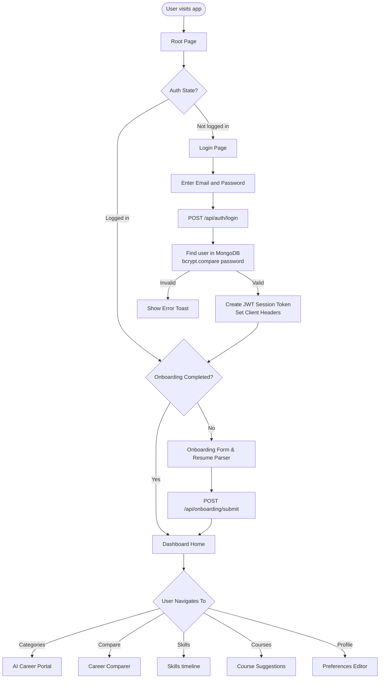

---

## 🔐 Authentication Flow

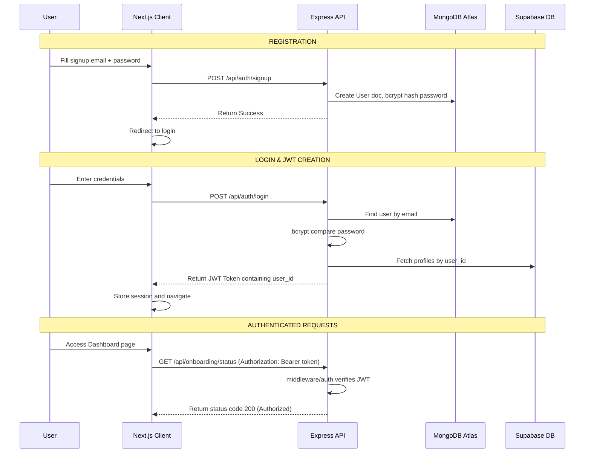

---

## 📊 Dashboard Overview

The dashboard loads all essential statistics and recommendation arrays in parallel to optimize rendering speeds:

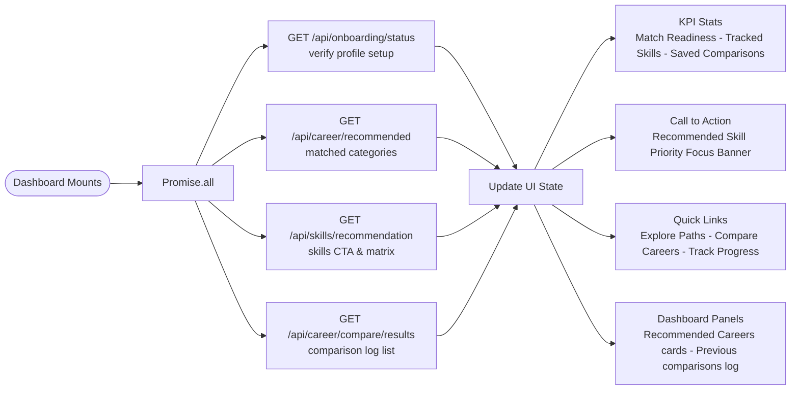

---

## 📦 Module 1 — Onboarding & Resume Parser

**Route:** `/onboarding`

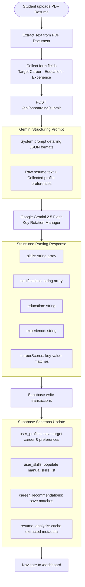

---

## 💼 Module 2 — Career Analysis & AI Advisor

**Routes:** `/dashboard/categories` | `/dashboard/categories/:id`

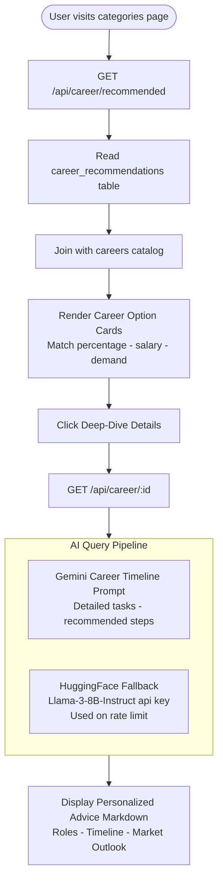

---

## ⚖️ Module 3 — Career Comparison

**Route:** `/dashboard/compare`

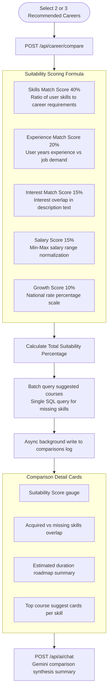

---

## 📊 Module 4 — Skills Timeline Tracker

**Route:** `/dashboard/skills`

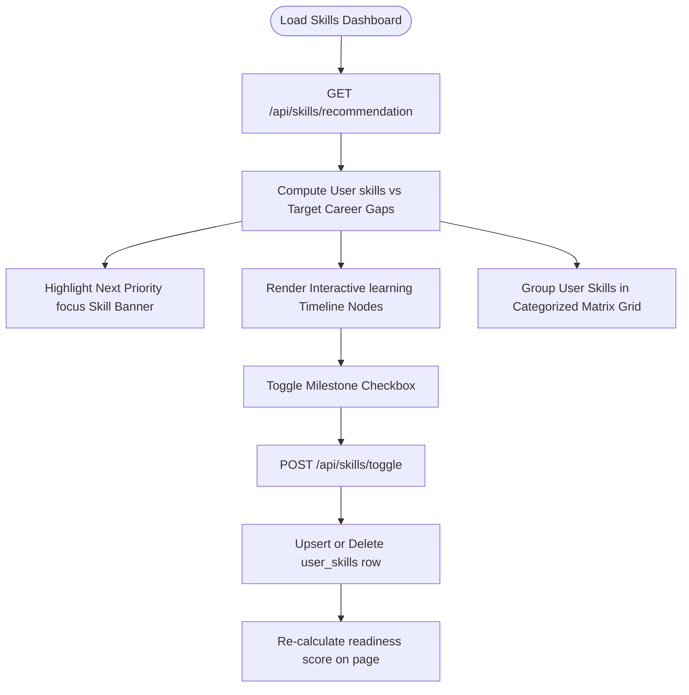

---

## 🎓 Module 5 — Course Suggestions

**Route:** `/dashboard/courses`

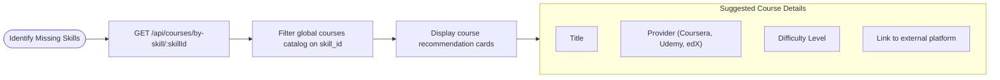

---

## 🗺️ Module 6 — Interactive Learning Roadmaps

**Route:** `/dashboard/roadmaps`

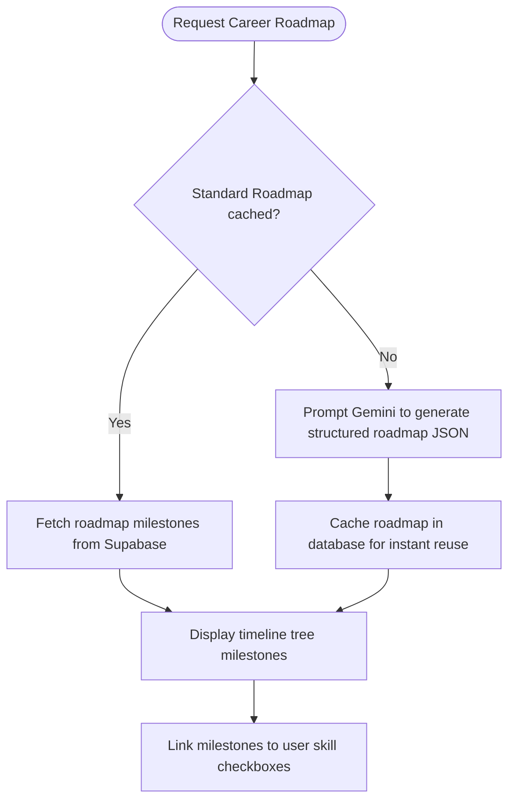

---

## 🗄 Database Architecture

### Supabase PostgreSQL Relational Schema

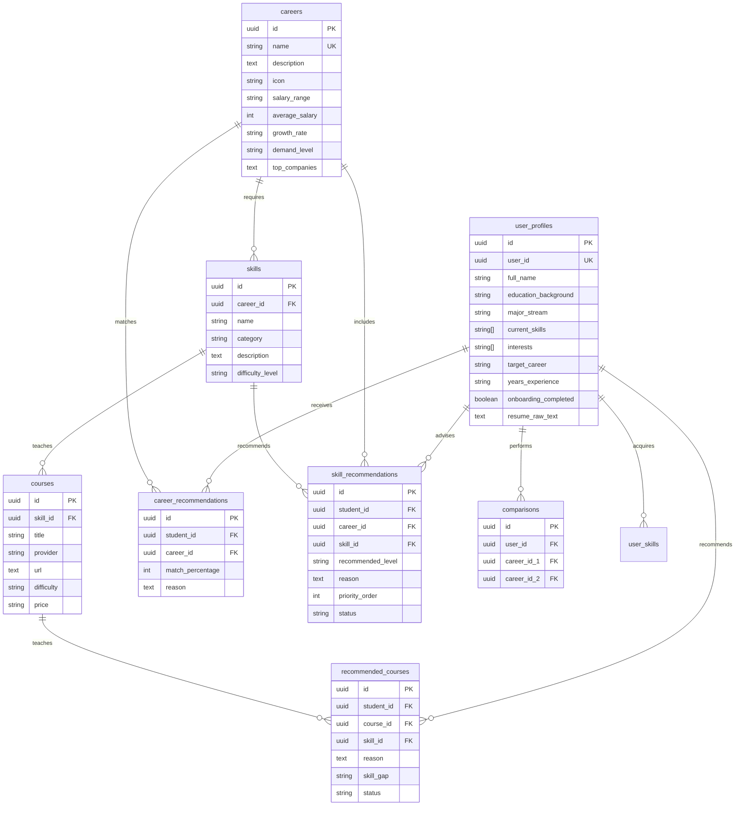

---

## 🔌 API Reference

### Authentication

| Method | Endpoint | Description | Body |
|--------|----------|-------------|------|
| `POST` | `/api/auth/signup` | Register a new user | `{ email, password }` |
| `POST` | `/api/auth/login` | Log in & receive session token | `{ email, password }` |
| `POST` | `/api/auth/forgot-password` | Generate reset token & email | `{ email }` |
| `POST` | `/api/auth/reset-password` | Update password with token | `{ token, newPassword }` |

### Onboarding & Profile

| Method | Endpoint | Description |
|--------|----------|-------------|
| `POST` | `/api/onboarding/submit` | Upload resume PDF & onboarding preference form |
| `GET` | `/api/onboarding/status` | Retrieve user onboarding completion status |
| `GET` | `/api/onboarding/recommendations` | Get career recommendations for dashboard |

### Careers & Comparer

| Method | Endpoint | Description |
|--------|----------|-------------|
| `GET` | `/api/career/recommended` | List recommended careers with match percentages |
| `GET` | `/api/career/:id` | Get details for single career pathway |
| `GET` | `/api/career/:id/skills` | List required skills for career |
| `POST` | `/api/career/compare` | Evaluate suitability scores between careers |
| `GET` | `/api/career/compare/results` | Fetch comparison history log |

### Skills & Timeline

| Method | Endpoint | Description |
|--------|----------|-------------|
| `GET` | `/api/skills/recommendation` | Fetch skills CTA focus, timeline nodes, & skills matrix |
| `POST` | `/api/skills/toggle` | Add/delete skill node from profile |
| `GET` | `/api/roadmaps` | Fetch developer roadmaps catalog |
| `GET` | `/api/roadmaps/personal/:careerId` | Generate personal milestone pathway roadmap |

---

## 🎨 Component Architecture

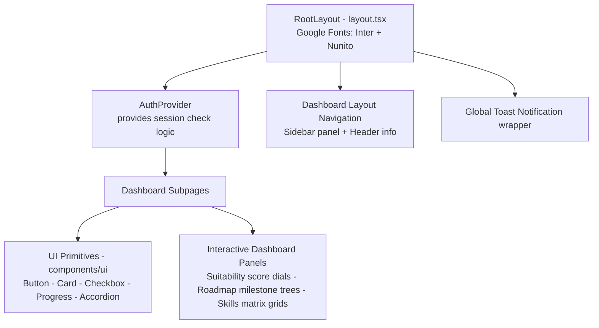

---

## ⚙️ Environment Variables

Create `.env` inside `apps/backend/`:

```env
# ── MongoDB ────────────────────────────────────────────────────────────
MONGODB_URI=mongodb+srv://<user>:<password>@cluster.mongodb.net/dbname

# ── Supabase ───────────────────────────────────────────────────────────
NEXT_PUBLIC_SUPABASE_URL=https://your-project-id.supabase.co
SUPABASE_SERVICE_ROLE_KEY=your_service_role_key

# ── Google Gemini AI ─────────────────────────────────────────────────
GEMINI_API_KEY=AIzaSy...
GEMINI_API_KEY_2=AIzaSy...
GEMINI_API_KEY_3=AIzaSy...

# ── JWT Session ──────────────────────────────────────────────────────
JWT_SECRET=your_secret_key_minimum_32_chars

# ── Server ───────────────────────────────────────────────────────────
PORT=3001
```

Create `.env.local` inside `apps/frontend/`:

```env
NEXT_PUBLIC_API_URL=http://localhost:3001
```

---

## 🚀 Getting Started

### Prerequisites

| Requirement | Version |
|-------------|---------|
| Node.js | 18.x or higher |
| npm | 9.x or higher |
| PostgreSQL / Supabase | Active instance |
| MongoDB Atlas | Free cluster |

### Installation

```bash
# 1. Clone the repository
git clone https://github.com/DHARANIVIP/Team-8.git
cd Team-8

# 2. Install dependencies
npm install

# 3. Paste schemas into Supabase
# Paste the queries from database.sql & database_update.sql in the Supabase SQL Editor

# 4. Start the backend developer server
cd apps/backend
npm run dev

# 5. Start the frontend developer server
cd ../frontend
npm run dev
```

---

## 🛠 Tech Stack

### Frontend

| Technology | Version | Purpose |
|-----------|---------|---------|
| **Next.js** | 16.x | Monorepo client framework |
| **React** | 19.x | UI library |
| **TypeScript** | 5.x | Static typing |
| **TailwindCSS** | 3.x | Styling |
| **Framer Motion** | 11.x | Animations |

### Backend

| Technology | Version | Purpose |
|-----------|---------|---------|
| **Express.js** | 4.x | REST API server |
| **MongoDB Atlas** | — | User authentication database |
| **Supabase PostgreSQL**| — | Relational applications database |
| **Mongoose** | 8.x | MongoDB object schema modeling |
| **jsonwebtoken** | 9.x | JWT token encoding/decoding |

---

<div align="center">

---

**Built by [Team 8](https://github.com/DHARANIVIP/Team-8)**

*Mastermind — Career Guidance Platform*

</div>
