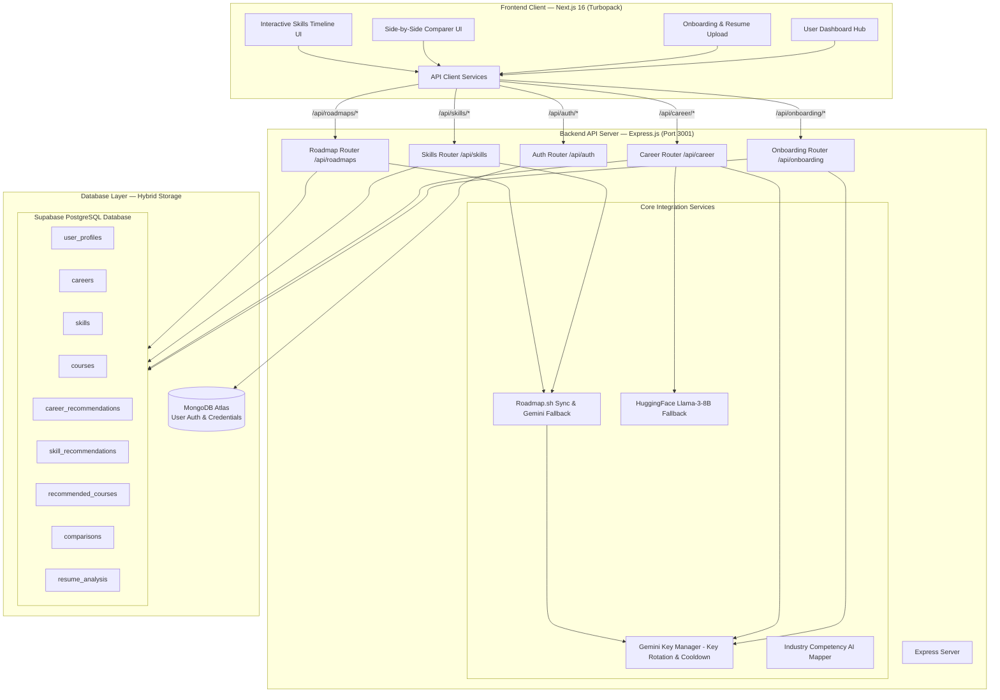

# 🧠 Mastermind — AI Career Pathway Guidance System

Mastermind is an AI-powered Career Guidance and Curriculum Recommendation system. It guides students through career discovery, multi-step onboarding, PDF resume parsing, side-by-side career suitability comparisons, skill gap analyses, interactive learning timelines, and course suggestions.

---

## 📐 System Architecture

The platform uses a hybrid storage model that separates authentication data from application and relational curriculum pathways. It features a robust key rotation manager to prevent API quota limits.



---

## 📦 Project Structure

Mastermind is organized as a monorepo containing `apps/frontend` and `apps/backend`:

```
Team8/
├── README.md                           # Developer documentation (this file)
├── package.json
└── apps/
    ├── backend/                        # Node.js Express Backend
    │   ├── server.js                   # Application bootstrap
    │   ├── database.sql                # Relational PostgreSQL setup
    │   ├── database_update.sql         # Database schema alterations
    │   ├── config/
    │   │   └── db.js                   # MongoDB client connection setup
    │   ├── middleware/
    │   │   └── auth.js                 # Authentication & JWT verification
    │   ├── models/
    │   │   └── User.js                 # MongoDB Mongoose model for User
    │   ├── routes/
    │   │   ├── auth.js                 # POST /api/auth/signup | login | reset
    │   │   ├── onboarding.js           # Multi-step resume parse & profile submission
    │   │   ├── career.js               # Career recommendations & comparer
    │   │   ├── skills.js               # Skills path advisor & matrix tracker
    │   │   └── roadmaps.js             # Learn path node endpoints
    │   └── services/
    │       ├── supabaseService.js      # Relational PostgreSQL queries and mappings
    │       ├── geminiKeyManager.js     # Robust API key rotation & cooldown manager
    │       ├── geminiCareerService.js  # AI career guidance prompt handlers
    │       ├── onetGeminiService.js    # Standard industry skill maps broker
    │       └── roadmapSyncService.js   # roadmap.sh & Gemini roadmap broker
    │
    └── frontend/                       # Next.js 16 Client Frontend
        ├── next.config.ts              # API proxy and image domains config
        └── src/
            └── app/
                ├── page.tsx            # Portal entry landing page
                ├── onboarding/         # Onboarding page with drag-and-drop resume PDF upload
                └── dashboard/          # Nested dashboard pages
                    ├── categories/     # Career Categories cards
                    ├── compare/        # Side-by-side career comparison cards
                    ├── skills/         # Interactive roadmap timelines
                    ├── courses/        # Course Suggestions directory
                    └── profile/        # Preferences & experience editor
```

---

## 🛠 Central Integration: Gemini Key Manager

To prevent Google Gemini API rate limits (`429 Too Many Requests`) from breaking user sessions, we implement a custom, stateful key manager:

- **Key Rotation**: Iterates sequentially through available keys (`GEMINI_API_KEY_1` to `GEMINI_API_KEY_20`) configured in `.env`.
- **Stateful Cooldown**: If a key receives a `429` error, the manager flags the key as rate-limited, sets a cooldown timer (typically 30 seconds), and immediately rotates to the next key.
- **Fail-Safe Mechanism**: Keeps trying keys until all are checked. If all keys fail, the backend falls back to local models or throws a descriptive developer exception.

---

## 🧩 Complete Module Specifications

### Module 1: Authentication & Session Management
* **Purpose**: Registers accounts, verifies logins, generates secure JWT tokens, and manages password reset cycles.
* **Architecture**:
  - **Auth DB**: MongoDB Atlas holds login credentials (`User` schema) with email uniqueness constraints.
  - **Tokens**: Node signs a JWT containing the user id, which is sent to the client and stored in local state/cookies.
  - **Middleware**: `protect` extracts the Bearer token, validates it against `JWT_SECRET`, and appends the user payload to the Express request object (`req.user`).
* **API Endpoints**:
  - `POST /api/auth/signup`: Create a user record.
  - `POST /api/auth/login`: Validate credentials and sign token.
  - `POST /api/auth/forgot-password`: Send token links to reset.
  - `POST /api/auth/reset-password`: Set new passwords using reset tokens.

### Module 2: Onboarding & Resume Analysis
* **Purpose**: Guides new users through a multi-step preference form (education, major, target career, years of experience) and extracts skills from uploaded PDF resumes.
* **Resume Parsing Engine**:
  - Extracts raw text content from uploaded PDFs on the backend.
  - Passes the raw text to Gemini using structured prompts asking for a JSON output containing:
    ```json
    {
      "skills": ["Python", "SQL", "Machine Learning"],
      "certifications": ["AWS Practitioner"],
      "education": "Bachelor of Computer Science",
      "experience": "2 years software intern",
      "careerScores": { "data_scientist_uuid": 90, "frontend_engineer_uuid": 45 },
      "growth_suggestions": "Focus on cloud computing certifications."
    }
    ```
- **Upsert Pipeline**:
  - Saves onboarding profiles to Supabase `user_profiles`.
  - Saves extracted skills to `user_skills` and creates recommendations in `career_recommendations`, `skill_recommendations`, and `recommended_courses`.
* **API Endpoints**:
  - `POST /api/onboarding/submit`: Submit preferences and resume files.
  - `GET /api/onboarding/status`: Verify onboarding completion.

### Module 3: AI Career Guidance Portal
* **Purpose**: Visualizes recommended career options, maps match percentages, and retrieves detailed insights.
* **Core Logic**:
  - Queries `career_recommendations` to fetch the top 5 AI-recommended career paths for a user.
  - Matches the recommended paths with the `careers` table to fetch metadata (salary range, growth rates, top companies).
  - Offers a dynamic **AI Career Deep-Dive** endpoint that queries the HuggingFace API (running Llama-3-8B) to fetch role timelines, daily tasks, and sector growth when Gemini is rate-limited.
* **API Endpoints**:
  - `GET /api/career/recommended`: Fetch top recommended careers.
  - `GET /api/career/:id`: Fetch specific career details.
  - `POST /api/career/refresh`: Clear existing recommendations and generate fresh paths.

### Module 4: Side-by-Side Career Comparer
* **Purpose**: Allows users to select 2 or 3 career paths to evaluate overlap percentages, skill gaps, salary comparisons, and overall suitability.
* **Suitability Score Calculation**:
  Calculated using a weighted formula matching user competencies against required career skills:
  $$totalScore = (skillsMatch \times 0.40) + (experienceMatch \times 0.20) + (interestMatch \times 0.15) + (salaryScore \times 0.15) + (growthScore \times 0.10)$$
  - **Skills Match ($0.40$)**: The ratio of acquired user skills to required career skills.
  - **Experience Match ($0.20$)**: Matches user profile experience level against required career seniority.
  - **Interest Match ($0.15$)**: Overlap between user interests and keywords in career descriptions.
  - **Salary Score ($0.15$)**: Normalized salary placement between minimum and maximum salaries of compared options.
  - **Growth Score ($0.10$)**: Normalized growth rate placement of compared careers.
* **Optimized Pipeline**:
  - Collects all missing skills across all compared careers.
  - Performs a single SQL query (`IN` filter on `courses`) to fetch all recommended courses at once, preventing nested loop database timeouts.
  - Saves comparison runs to a log history table asynchronously to keep page loading times fast.
* **API Endpoints**:
  - `POST /api/career/compare`: Run side-by-side career comparison.
  - `GET /api/career/compare/results`: Fetch user's previous comparison logs.

### Module 5: Skills progression & Timeline Tracker
* **Purpose**: Guides users through their learning milestones, showing acquired skills, next active priorities, and interactive timeline trees.
* **Milestone Timeline Tree**:
  - Mapped from `roadmap.sh` configuration files or generated via Gemini if a custom career path is used.
  - Shows sequential steps structured into Topics (e.g., "Programming Basics") and Subtopics (e.g., "Learn Python syntax", "Variables").
* **Interactive Features**:
  - **Next Recommended Skill Banner**: A dynamic CTA component displaying the highest priority missing skill from the user's target career pathway.
  - **Progress Checkbox Toggles**: Marking a skill node as completed instantly creates a row in `user_skills`, updates the gap analysis, and modifies the roadmap without needing a full page reload.
  - **User Skills Matrix**: Displays a grid of user competencies grouped by category (e.g., Languages, databases, Cloud) and labeled by proficiency (Beginner, Intermediate, Expert).
* **API Endpoints**:
  - `GET /api/skills/recommendation`: Fetch next skills CTA, roadmap nodes, and skill matrix.
  - `POST /api/skills/toggle`: Add or remove an acquired skill.

### Module 6: Course Suggestion & Gaps Mapping
* **Purpose**: Compares user competencies with required career skills to identify skill gaps and suggest matching courses.
* **Core Logic**:
  - Computes missing skills and evaluates "weak skills" (skills marked as `Beginner` where `Expert` is needed).
  - Queries the `courses` catalog to suggest online courses corresponding to identified gaps.
  - Persists recommended courses to the database to ensure fast, consistent dashboard loading times.
* **API Endpoints**:
  - `GET /api/courses`: Fetch the global courses database catalog.
  - `GET /api/courses/by-skill/:skillId`: Fetch suggested courses for a specific skill.

### Module 7: Interactive Learning Roadmaps
* **Purpose**: Synchronizes, caches, and renders developer roadmaps based on industry standards.
* **Core Logic**:
  - Checks if a standard roadmap (e.g., Frontend, Backend, DevOps) exists in the database.
  - If a standard roadmap is found, it fetches curriculum nodes from local JSON caches synced with `roadmap.sh`.
  - If a custom roadmap is requested, it prompts Gemini to generate a structured roadmap structure matching standard formats:
    ```json
    {
      "milestones": [
        { "title": "Database fundamentals", "subtopics": ["SQL Syntax", "Indexing"] }
      ]
    }
    ```
* **API Endpoints**:
  - `GET /api/roadmaps`: Fetch all available roadmaps.
  - `GET /api/roadmaps/personal/:careerId`: Retrieve a personalized roadmap pathway.

---

## 🗄 Relational Database Schema DDL (Supabase)

```sql
-- Careers Catalog Table
CREATE TABLE careers (
    id UUID PRIMARY KEY DEFAULT gen_random_uuid(),
    name VARCHAR(255) NOT NULL UNIQUE,
    description TEXT,
    icon VARCHAR(50),
    salary_range VARCHAR(100),
    average_salary INT DEFAULT 0,
    growth_rate VARCHAR(50),
    demand_level VARCHAR(50),
    top_companies TEXT,
    created_at TIMESTAMP WITH TIME ZONE DEFAULT CURRENT_TIMESTAMP
);

-- Skills Database Catalog
CREATE TABLE skills (
    id UUID PRIMARY KEY DEFAULT gen_random_uuid(),
    career_id UUID REFERENCES careers(id) ON DELETE CASCADE,
    name VARCHAR(255) NOT NULL,
    category VARCHAR(100),
    description TEXT,
    difficulty_level VARCHAR(50) DEFAULT 'Medium',
    created_at TIMESTAMP WITH TIME ZONE DEFAULT CURRENT_TIMESTAMP
);

-- Courses Database Catalog
CREATE TABLE courses (
    id UUID PRIMARY KEY DEFAULT gen_random_uuid(),
    skill_id UUID REFERENCES skills(id) ON DELETE CASCADE,
    title VARCHAR(255) NOT NULL,
    provider VARCHAR(100),
    url TEXT,
    difficulty VARCHAR(50),
    price VARCHAR(50),
    created_at TIMESTAMP WITH TIME ZONE DEFAULT CURRENT_TIMESTAMP
);

-- User Profiles Table
CREATE TABLE user_profiles (
    id UUID PRIMARY KEY DEFAULT gen_random_uuid(),
    user_id UUID NOT NULL UNIQUE,
    full_name VARCHAR(255),
    education_background VARCHAR(255),
    major_stream VARCHAR(255),
    current_skills TEXT[] DEFAULT '{}',
    interests TEXT[] DEFAULT '{}',
    target_career VARCHAR(255),
    years_experience VARCHAR(50),
    onboarding_completed BOOLEAN DEFAULT FALSE,
    resume_raw_text TEXT,
    created_at TIMESTAMP WITH TIME ZONE DEFAULT CURRENT_TIMESTAMP
);

-- User Skills Table
CREATE TABLE user_skills (
    id UUID PRIMARY KEY DEFAULT gen_random_uuid(),
    user_id UUID NOT NULL REFERENCES user_profiles(user_id) ON DELETE CASCADE,
    skill_name VARCHAR(255) NOT NULL,
    proficiency VARCHAR(50) DEFAULT 'Intermediate',
    progress_percentage INT DEFAULT 0,
    source VARCHAR(50) DEFAULT 'manual',
    created_at TIMESTAMP WITH TIME ZONE DEFAULT CURRENT_TIMESTAMP,
    UNIQUE(user_id, skill_name)
);

-- Career Recommendations Table
CREATE TABLE career_recommendations (
    id UUID PRIMARY KEY DEFAULT gen_random_uuid(),
    student_id UUID NOT NULL REFERENCES user_profiles(user_id) ON DELETE CASCADE,
    career_id UUID NOT NULL REFERENCES careers(id) ON DELETE CASCADE,
    match_percentage INT NOT NULL,
    reason TEXT,
    recommended_at TIMESTAMP WITH TIME ZONE DEFAULT CURRENT_TIMESTAMP,
    UNIQUE(student_id, career_id)
);

-- Skill Recommendations Table
CREATE TABLE skill_recommendations (
    id UUID PRIMARY KEY DEFAULT gen_random_uuid(),
    student_id UUID NOT NULL REFERENCES user_profiles(user_id) ON DELETE CASCADE,
    career_id UUID NOT NULL REFERENCES careers(id) ON DELETE CASCADE,
    skill_id UUID NOT NULL REFERENCES skills(id) ON DELETE CASCADE,
    recommended_level VARCHAR(50) DEFAULT 'Beginner',
    reason TEXT,
    priority_order INT DEFAULT 1,
    status VARCHAR(50) DEFAULT 'pending',
    created_at TIMESTAMP WITH TIME ZONE DEFAULT CURRENT_TIMESTAMP,
    updated_at TIMESTAMP WITH TIME ZONE DEFAULT CURRENT_TIMESTAMP,
    UNIQUE(student_id, career_id, skill_id)
);

-- Course Recommendations Table
CREATE TABLE recommended_courses (
    id UUID PRIMARY KEY DEFAULT gen_random_uuid(),
    student_id UUID NOT NULL REFERENCES user_profiles(user_id) ON DELETE CASCADE,
    course_id UUID NOT NULL REFERENCES courses(id) ON DELETE CASCADE,
    skill_id UUID NOT NULL REFERENCES skills(id) ON DELETE CASCADE,
    reason TEXT,
    skill_gap VARCHAR(255),
    status VARCHAR(50) DEFAULT 'recommended',
    recommended_at TIMESTAMP WITH TIME ZONE DEFAULT CURRENT_TIMESTAMP,
    UNIQUE(student_id, course_id)
);

-- Comparison Logs Table
CREATE TABLE comparisons (
    id UUID PRIMARY KEY DEFAULT gen_random_uuid(),
    user_id UUID NOT NULL REFERENCES user_profiles(user_id) ON DELETE CASCADE,
    career_id_1 UUID NOT NULL REFERENCES careers(id) ON DELETE CASCADE,
    career_id_2 UUID NOT NULL REFERENCES careers(id) ON DELETE CASCADE,
    created_at TIMESTAMP WITH TIME ZONE DEFAULT CURRENT_TIMESTAMP
);
```

---

## 🛠 Quick Start Guide

### 1. Configure Environments

#### Backend (`apps/backend/.env`)
```env
MONGODB_URI=mongodb+srv://<user>:<password>@cluster.mongodb.net/<dbname>
NEXT_PUBLIC_SUPABASE_URL=https://your-project-id.supabase.co
SUPABASE_SERVICE_ROLE_KEY=your_service_role_key
JWT_SECRET=your_jwt_secret
PORT=3001
GEMINI_API_KEY=AIzaSy...
GEMINI_API_KEY_2=AIzaSy...
```

#### Frontend (`apps/frontend/.env.local`)
```env
NEXT_PUBLIC_API_URL=http://localhost:3001
```

### 2. Run Servers

**Backend server (Port 3001)**:
```bash
cd apps/backend
npm run dev
```

**Frontend server (Port 3000)**:
```bash
cd apps/frontend
npm run dev
```
